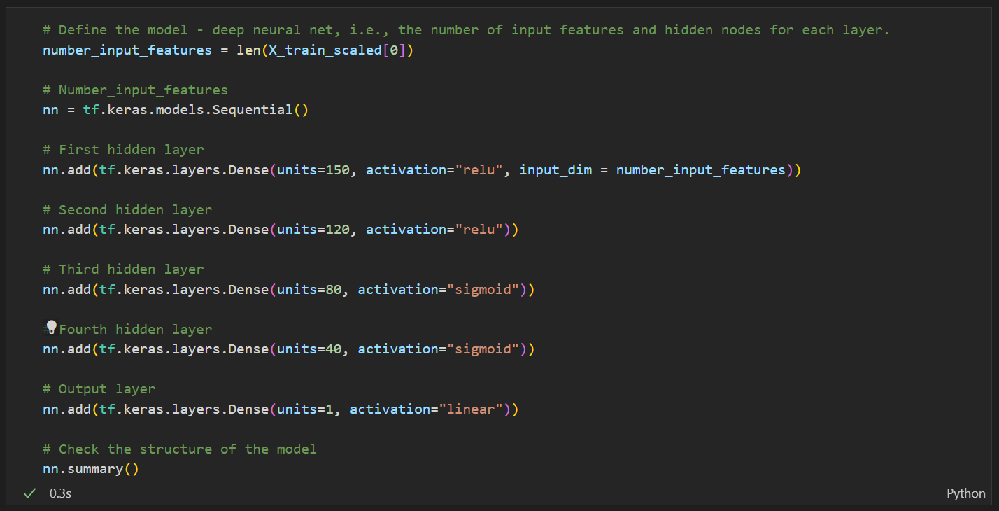

# Neural_Network_Charity_Analysis

## Overview

Alphabet Soup is a philantropic foundation dedicated to helping organizations that protect the environment, improve people's well-being and unify the world. They have raised and donated over $10B in the past 20 years, and they wish to investigate which organizations are worth donating to and which are too high-risk. With our knowledge of machine learning and neural networks, we will use the features in the provided dataset to help our friend Beks create a binary classifier that is capable of predicting whether applicants will be successful if funded by Alphabet Soup. We have received a CSV file containing more than 34,000 organizations that have received funding from Alphabet Soup over the years, and we'll need to preprocess the dataset in order to compile, train, and evaluate the neural network model.

## Data Preprocessing

- What variable(s) are considered the target(s) for your model?
We want to focus on organizations that have been successfully funded by Alphabet Soup, so that should be our target.

- What variable(s) are considered to be the features for your model?
Therefore we are choosing the IS_SUCCESSFUL column as the feature for our model.

- What variable(s) are neither targets nor features, and should be removed from the input data?
The EIN and NAME columns will not increase the accuracy of the model and can be removed to improve code efficiency.

## Compiling, Training, and Evaluating the Model

- How many neurons, layers, and activation functions did you select for your neural network model, and why?

In the optimized model, layer 1 started with 150 neurons with a relu activation. For layer 2, it dropped to 120 neurons and continued with the relu activation. From there, the sigmoid activation seemed to be the better fit for layers 3 (80 neurons) and layer 4 (40 neurons).
  
(click the image to enlarge)
 

- Were you able to achieve the target model performance?

- What steps did you take to try and increase model performance?

